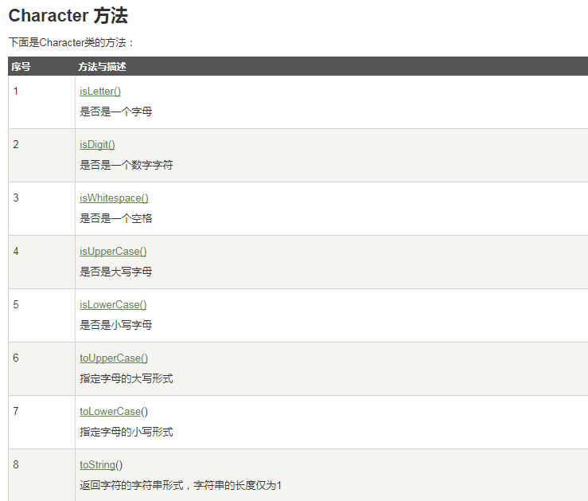
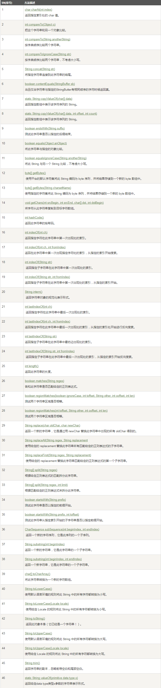
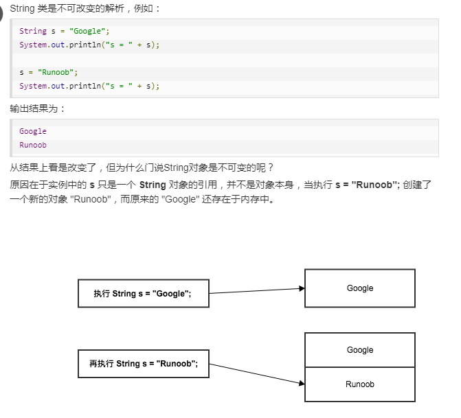
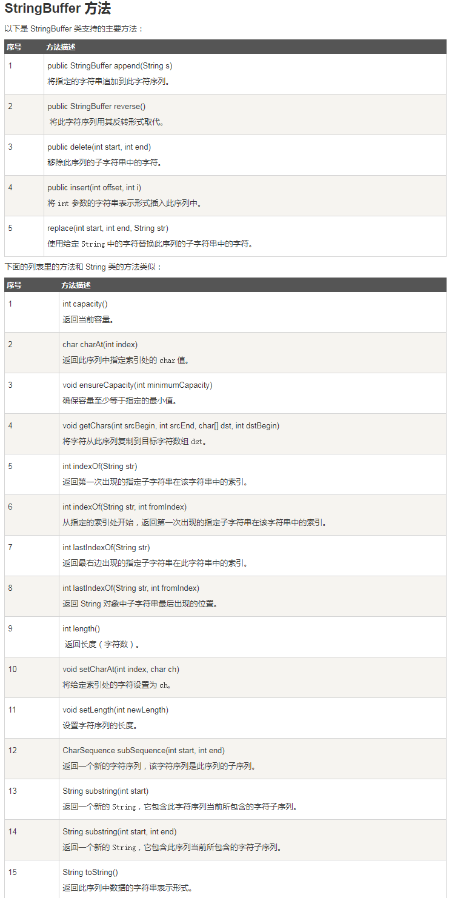

## Character 常用方法



---

## String 常用方法




### String是不可变的



---

## StringBuffer  &  StringBuilder

- StringBuffer 和 StringBuilder 类的对象能够被多次的修改，并且不产生新的未使用对象。

- StringBuilder 有速度优势;在要求线程安全的情况下，必须使用 StringBuffer 。


``` java
public class Test{
  public static void main(String args[]){
    StringBuffer sBuffer = new StringBuffer("菜鸟教程官网：");
    sBuffer.append("www");
    sBuffer.append(".runoob");
    sBuffer.append(".com");
    System.out.println(sBuffer);  
  }
}

```

### StringBuffer 常用方法



---

## 数组

