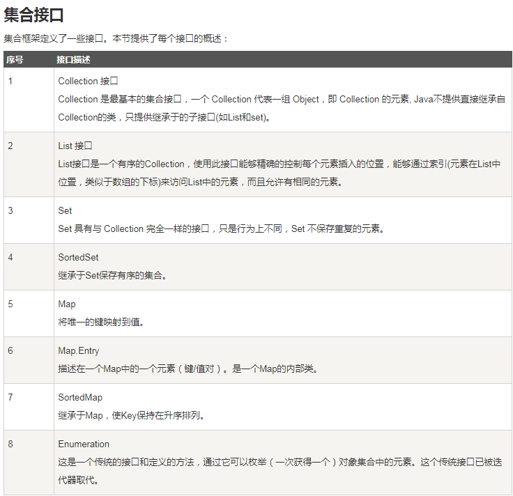

## 数据结构

- 枚举（Enumeration）
- 位集合（BitSet）
- 向量（Vector）
- 栈（Stack）
- 字典（Dictionary）
- 哈希表（Hashtable）
- 属性（Properties）

## 集合框架

``` shell
集合框架是一个用来代表和操纵集合的统一架构。所有的集合框架都包含如下内容：

接口：是代表集合的抽象数据类型。接口允许集合独立操纵其代表的细节。在面向对象的语言，接口通常形成一个层次。
实现（类）：是集合接口的具体实现。从本质上讲，它们是可重复使用的数据结构。
算法：是实现集合接口的对象里的方法执行的一些有用的计算，例如：搜索和排序。这些算法被称为多态，那是因为相同的方法可以在相似的接口上有着不同的实现。

```

