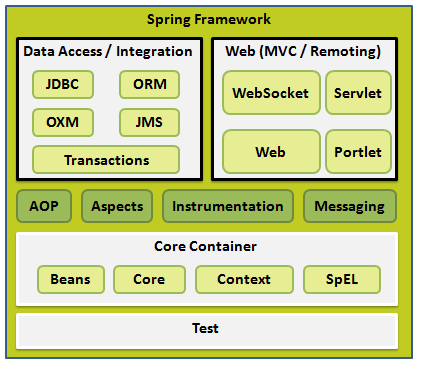

## Spring 体系结构


#### 主要内容
- IoC容器
- 依赖注入
- Beans 自动装配
- 基于注解的配置
- AOP
- JDBC框架
- 事务管理
- MVC框架

> 理解：
  IoC控制反转：抛弃new的方法取得对象，通过Spring配置来取得对象。

>  一站式框架

> web层： SpringMVC

>  service层： IoC

>  DAO层： JDBCTemplate


---

## 创建项目

- 使用IDEA professional的可在新建项目时选择spring。

- 对于IDEA community可以在 new project 选择maven；


> 如果图中archetype一直显示loading，按下图修改：


- 在项目的pom.xml中添加springframwwork依赖,然后reimport

  ``` java
  <dependency>
      <groupId>org.springframework</groupId>
      <artifactId>spring-context</artifactId>
      <version>4.3.13.RELEASE</version>
  </dependency>
  ```
