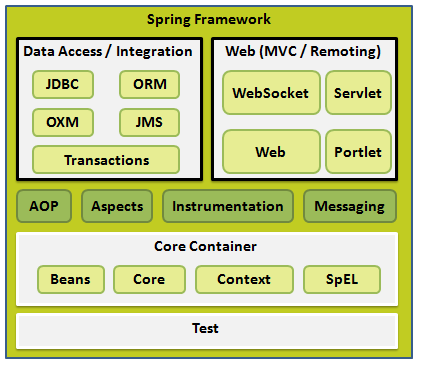

## Spring 体系结构

#### 主要内容
- IoC容器
- 依赖注入
- Beans 自动装配
- 基于注解的配置
- AOP
- JDBC框架
- 事务管理
- MVC框架

> 理解：
  IoC控制反转：抛弃new的方法取得对象，通过Spring配置来取得对象。

>  一站式框架

> web层： SpringMVC

>  service层： IoC

>  DAO层： JDBCTemplate
