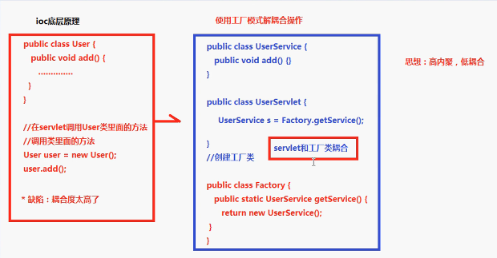

### IoC 原理
1. xml配置文件
2. dom4j解析xml
3. 工厂设计模式
4. 反射

#### 使用IoC之前的一般处理方法


#### IoC处理


### IoC入门案例


### spring 层次图


### bean xml配置文件实例

``` xml
<?xml version="1.0" encoding="UTF-8"?>

<beans xmlns="http://www.springframework.org/schema/beans"
    xmlns:xsi="http://www.w3.org/2001/XMLSchema-instance"
    xsi:schemaLocation="http://www.springframework.org/schema/beans
    http://www.springframework.org/schema/beans/spring-beans-3.0.xsd">

   <!-- A simple bean definition -->
   <bean id="..." class="...">
       <!-- collaborators and configuration for this bean go here -->
   </bean>

   <!-- A bean definition with lazy init set on -->
   <bean id="..." class="..." lazy-init="true">
       <!-- collaborators and configuration for this bean go here -->
   </bean>

   <!-- A bean definition with initialization method -->
   <bean id="..." class="..." init-method="...">
       <!-- collaborators and configuration for this bean go here -->
   </bean>

   <!-- A bean definition with destruction method -->
   <bean id="..." class="..." destroy-method="...">
       <!-- collaborators and configuration for this bean go here -->
   </bean>

   <!-- more bean definitions go here -->

</beans>
```

### 注意

xml文件放在src/main/resources/   路径下
