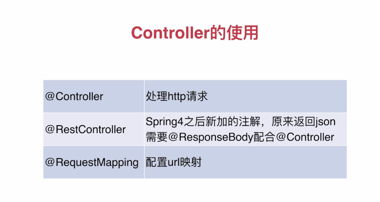
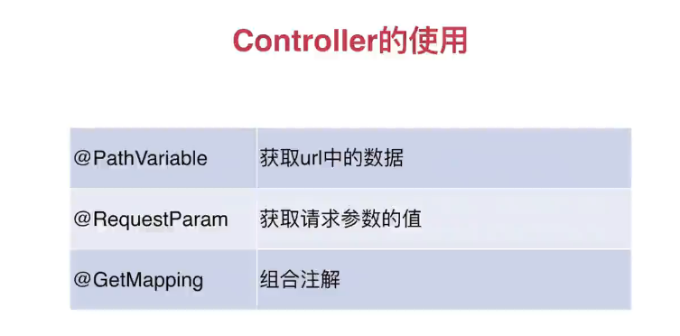
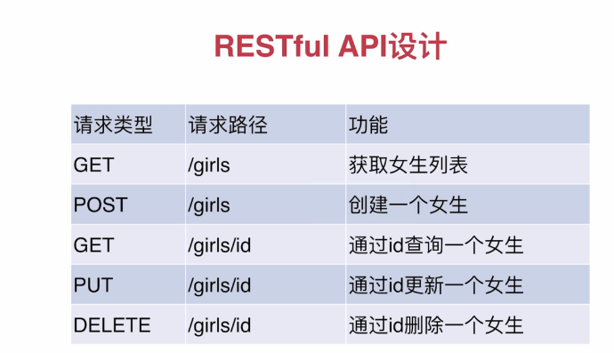

## Spring Initializr

- 对于Spring boot可以使用IDEA professional进行创建spring boot项目。也可以在http://start.spring.io/  创建项目然后本地IDE打开。

- 项目启动有多种方法：

    - 直接运行xxxxApplication文件
	
	- mvn  spring-boot：run
	
	- 运行mvn  install编译后，在target目录下 java -jar  xxx.jar
	
### helloworld

``` java
@RestController
public class HelloSpringBoot {


    @RequestMapping(value="/hello", method = RequestMethod.GET)
    public String hello() {
        return "Hello Spring Boot!";
    }
}

```
	
### 配置文件 application.properties

    - 换成application.yml更方便
	
	- 变量注解:   
	   ``` java
	   @value("${name}")
	   private String name;
	   ```
	   
	-类注解：
	``` java
	@Component
	@ConfigurationProperties(prefix= "people")
	public class People{
	    
		private String name;
	
	}
	
	// 使用
	
	@Autowired
	private People  p1
	
	p1.getName()
	```
	
	- 多环境配置
	
	    application-dev.yml和application-prod.yml
 	     
		在application.yml中配置：
		
		``` java
		spring:
		    profile:
			    active: dev
		```
		
		- 用jar包启动时可带参数  --spring.profiel.active=prod
		
### Controller






### 数据库的使用

- Spring-Data-Jpa（java persistence API）

- 添加组件：spring-boot-starter-data-jpa ；mysql-connector-java

``` java
1. pom,xml添加依赖

		<dependency>
			<groupId>org.springframework.boot</groupId>
			<artifactId>spring-boot-starter-jpa</artifactId>
		</dependency>

		<dependency>
			<groupId>mysql</groupId>
			<artifactId>mysql-connector-java</artifactId>
		</dependency>
		
2.配置
    datasource:
        driver-class-name: com.mysql.jdbc.Driver
        url: jdbc:mysql://127.0.0.1:3306/dbname
        username: 
        password: 
    jpa:
        hibernate:
            ddl-auto: update
        show-sql: true
		
3. 类加上注解可 对应生成数据库表

@Entity

id属性加上注解
@Id
@GenerateValue
```


### Restful API设计实现


		