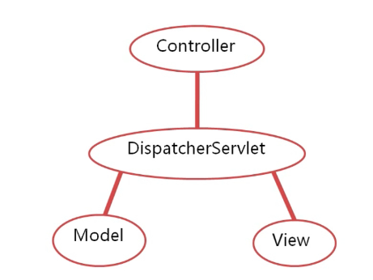
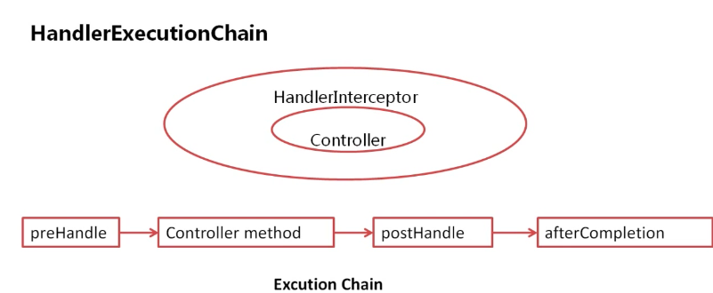
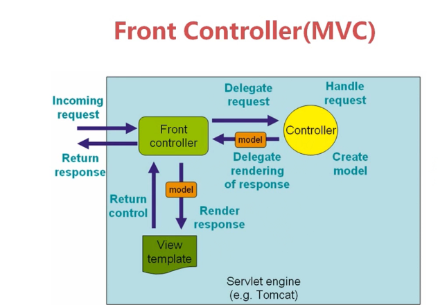

## 基本概念

- DispatcherServelet是前端控制器

- HandlerAdapter相当于controller,DispatcherServelet调用各种HandlerAdapter来实现任务分发给相关的业务逻辑

- HandlerInterceptor是一个接口，可以用来在Handler调用之前，之后，以及view呈现后可以做很多事情

- HandlerMapping是负责确定DispatcherServelet与controller之间映射的类，告诉DispatcherServelet，在请求到来后，由哪个controller来响应这个请求

