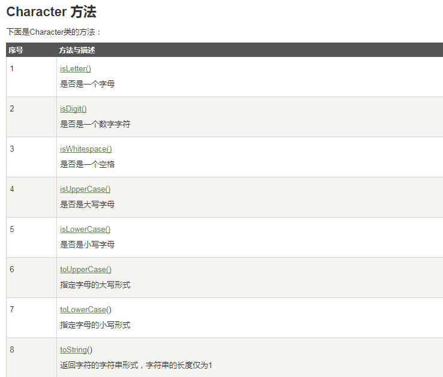
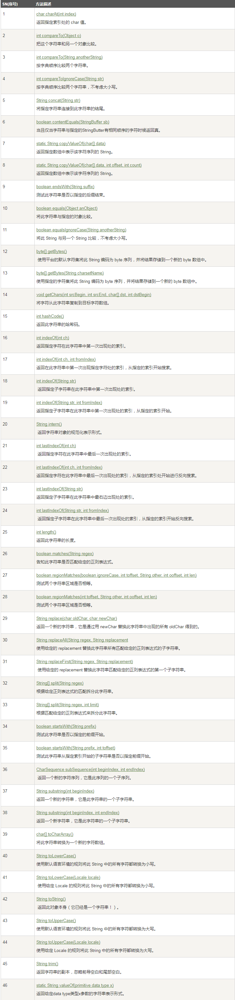
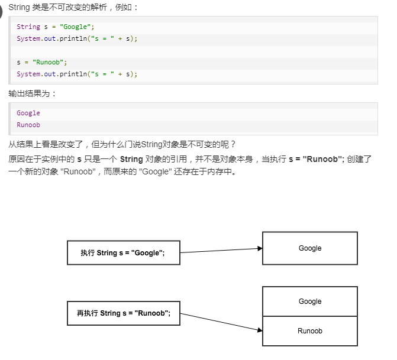
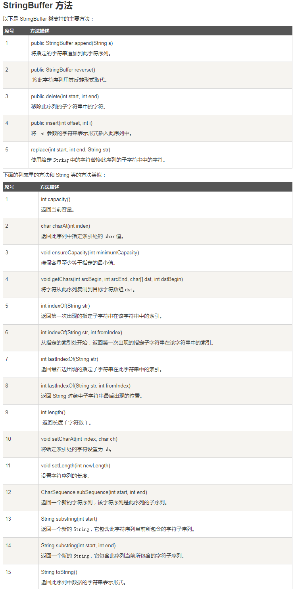
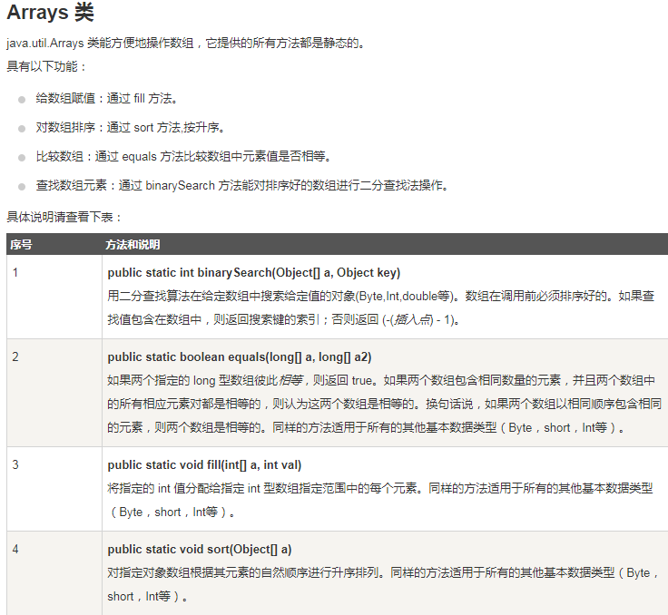

## Character 常用方法



---

## String 常用方法




### String是不可变的



---

## StringBuffer  &  StringBuilder

- StringBuffer 和 StringBuilder 类的对象能够被多次的修改，并且不产生新的未使用对象。

- StringBuilder 有速度优势;在要求线程安全的情况下，必须使用 StringBuffer 。


``` java
public class Test{
  public static void main(String args[]){
    StringBuffer sBuffer = new StringBuffer("官网：");
    sBuffer.append("www");
    sBuffer.append(".google");
    sBuffer.append(".cn");
    System.out.println(sBuffer);  
  }
}

```

### StringBuffer 常用方法



---

## 数组

- 声明数组：dataType[] arrayRefVar;   // 首选的方法

- 创建数组：arrayRefVar = new dataType[arraySize];

- 合在一起：dataType[] arrayRefVar = new dataType[arraySize];

``` java
//foreach 循环

public class TestArray {
   public static void main(String[] args) {
      double[] myList = {1.9, 2.9, 3.4, 3.5};
 
      // 打印所有数组元素
      for (double element: myList) {
         System.out.println(element);
      }
   }
}
```

### 多维数组

- type arrayName = new type[arraylenght1][arraylenght2];

- 例：int a[][] = new int[2][3];

### 数组常用方法


