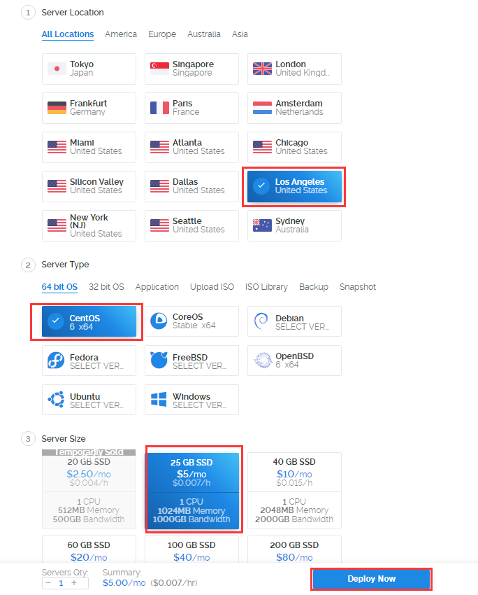
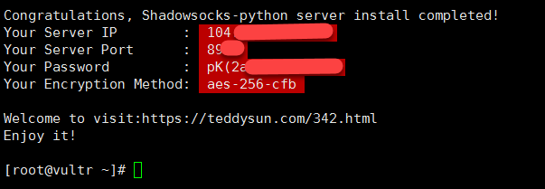
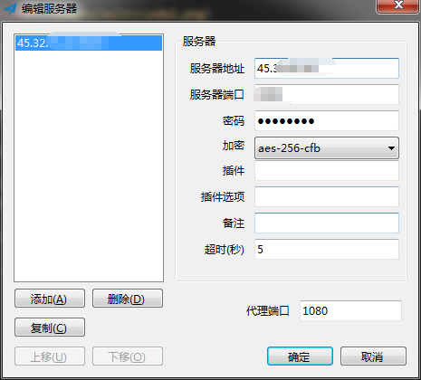

---

# 在vultr上搭建代理服务器

## Server

1. 在vultr上创建账户，并购买一台服务器，5美元每月即可。可以使用alipay支付，最低充值10美元。（推荐centos7系统）（https://www.vultr.com/）


2. 使用ssh客户端登录服务器，例如Xshell或者直接命令行  ssh root@ip 。复制你的服务器的ip和密码登录。


3. 执行以下代码下载shadowsocks服务端安装脚本。

```shell
wget --no-check-certificate  https://raw.githubusercontent.com/teddysun/shadowsocks_install/master/shadowsocks.sh

```


4. 修改脚本权限

``` shell
chmod +x shadowsocks.sh
```

5. 运行安装脚本

``` shell
./shadowsocks.sh 2>&1 | tee shadowsocks.log
```

设置密码，并选择加密算法：


最后等待安装，成功后显示：



至此，服务端安装完毕!

---
# 服务器设置

- 卸载方法：
``` shell
./shadowsocks.sh uninstall

```

- 单用户配置文件示例（文件路径： ／etc/shadowsocks.json）

```
{
    "server":"0.0.0.0",
    "server_port":your_server_port,
    "local_address":"127.0.0.1",
    "local_port":1080,
    "password":"your_password",
    "timeout":300,
    "method":"your_encryption_method",
    "fast_open": false
}
```

- 多用户多端口配置文件示例

```
{
    "server":"0.0.0.0",
    "local_address":"127.0.0.1",
    "local_port":1080,
    "port_password":{
         "8989":"password0",
         "9001":"password1",
         "9002":"password2",
         "9003":"password3",
         "9004":"password4"
    },
    "timeout":300,
    "method":"your_encryption_method",
    "fast_open": false
}
```
> 配置多端口后，需要防火墙打开新增的端口。安装脚本中默认单端口。

    centos7 防火墙命令
         firewall-cmd --permanent --zone=public --add-port=8990/tcp
         firewall-cmd --permanent --zone=public --add-port=8990/udp
         firewall-cmd  --reload

- 使用命令

```
启动：/etc/init.d/shadowsocks start

停止：/etc/init.d/shadowsocks stop

重启：/etc/init.d/shadowsocks restart

状态：/etc/init.d/shadowsocks status

```

---
# 安装锐速+bbr 加速

1.更换centos内核

```
rpm -ivh http://soft.91yun.org/ISO/Linux/CentOS/kernel/kernel-3.10.0-229.1.2.el7.x86_64.rpm --force

```

2.安装锐速

```
wget -N --no-check-certificate https://raw.githubusercontent.com/91yun/serverspeeder/master/serverspeeder-all.sh && bash serverspeeder-all.sh
```
可能会提示内核版本问题，选择一个最接近的版本即可


3.使用google bbr

```
wget --no-check-certificate https://github.com/teddysun/across/raw/master/bbr.sh
chmod +x bbr.sh
./bbr.sh
```
> Google 开源了其 TCP BBR 拥塞控制算法，并提交到了 Linux 内核，从 4.9 开始，Linux 内核已经用上了该算法。
---

## Clients

不同平台有对应的客户端：https://shadowsocks.org/en/download/clients.html


- windows 客户端：

    - 链接：[shadowsocks-windows-client-4.0.6.zip](images/vultr/Shadowsocks-4.0.6.zip)

    - 

- android 客户端：

    - 可通过Google play下载。但一般没有翻过去也没法下载，在网上搜索的apk安装后试验，速度比较慢。

- ios 客户端：

    - 可以讲app store 账号的国家设置为美国，搜索wingy下载。（国内appstore已下架）

- mac 客户端：

    - 链接： https://github.com/shadowsocks/ShadowsocksX-NG/releases
