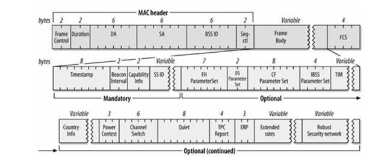
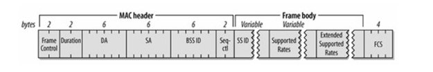
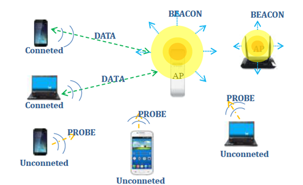

WiFi使用的网络协议，WiFi采用的是IEEE802.11协议集，此协议集包含许多子协议。其中按照时间顺序发展，主要有：

（1）802.11a，

（2）802.11b，        

（3）802.11g

（4）802.11n，。

在网络通信中，数据被封装成了帧，帧就是指通信中的一个数据块。但是帧在数据链路层传输的时候是有固定格式的，不是随便的封装和打包就可以传输，大小有限制，最小46字节，最大1500字节所以我们必须按照这个规则来封装。

下面802.11的帧结构：

| 前导码 | 前定界符 | 目的地址 | 源目的地址 | 长度字段 | 数据字段 | 校验字段 |
| - - - -|- - - - -| - - - - | - - - - - | - - - - | - - - - -| - - - - |
| 7B     |  1B     |   6B    |    6B     |    2B   |  46-1500 |   4B    |

在802.11中的帧有三种类型：管理帧（Management Frame，例如Beacon帧、Probe Request帧）、控制帧（Control Frame，例如RTS帧、CTS帧、ACK帧）、数据帧（Data Frame，承载数据的载体，其中的DS字段用来标识方向很重要）。帧头部中的类型字段中会标识出该帧属于哪个字段。

我们主要介绍下WiFi探针技术相关的几种帧：

**1.管理帧：**

- *BeaconFrame*：信标帧，是相当重要的维护机制，主要来宣告某个AP网络的存在。定期发送的信标，可让移动WiFi设备得知该网络的存在，从而调整加入该网络所必要的参数。在基础网络里，AP必须负责发送Beacon帧，Beacon帧所及范围即为基本服务区域。  在基础型网络里，所有沟通都必须通过接入点，因此WiFi设备不能距离太远，否则无法接收到信标。

   下图是帧格式：

   

- *Probe Request*：探测请求帧，WiFi设备将会利用Probe Request帧，扫描所在区域内目前有哪些802.11网络。

    下图是帧格式：
    

**2.数据帧**：

- *Data*：数据帧，当接入点要送出一个帧给WiFi设备但是不必确认之前所传送的信息时，就会使用标准的数据帧。标准的数据帧并不会征询对方是否有数据待传，因此不允许接收端传送任何数据。无竞争周期所使用的纯数据（Data-Only)帧和无竞争周期所使用的数据帧完全相同。

就像图中描述的一样，我们的WiFi探针其实就是一个AP，它定时的向自己的四周广播发送Beacon帧，用来通知附近的WiFi设备，AP是存在的，（好比它一直在向周围喊着，我在这里，大家快来连接我啊）。

我们的WiFi设备，手机，平板电脑等，也不停的发送着probe帧，去寻找附近可用的AP。在probe帧的介绍中就我们可以看到probe帧包含了设备的mac地址，当我们的AP接收到probe帧之后就获取了这个设备的MAC地址，而这个AP就是我们的WIFI探针。因此只要在WiFi探针覆盖区域内的设备打开着WiFi，探针就能收集到他的MAC地址。

----
关于探针安全

- 探针所收集的数据内容

    > 我们来看看WiFi探针设备究竟会收集什么信息？前面我们已经看到了，在不连接WiFi的情况下，移动设备只会发送probe帧，此时我们并不能通过探针访问网络进行数据传输，探针仅仅只能接收到WiFi设备发送的probe帧，收集probe帧携带的MAC地址，所以此时我们收集到信息是绝对无关用户个人信息和设备上其他信息的。

- 探针不提供上网功能，WiFi提供上网功能

    >探针不提供上网功能，所以用户与探针之间的数据流量仅限在探针发送广播，移动设备发送一次连接请求，而手机号码，用户姓名，性别等等个人信息和设备的详细信息都不包含在里面。但是WiFi就不一样了。因为用户可以用它来上网，可以说用户所有流量都是WiFi可以看到的。而流量的内容里面有很多是关于用户个人信息的。比如用户在网上填写市场调查问卷，可能就有一些用户信息，比如性别，年龄，手机号码等。甚至那种别有用心的人提供的WiFi会估计记录用户的一些敏感信息，比如用户上网时输入的密码等等。这也是安全相关人士经常提到的不要随便上别人的WiFi的原因。

- 探针的数据处理

    >由于探针本身设计仅仅是探测周边有些什么设备，因此并不产生大量数据，设计的时候就不会将收集到的数据存储在本身，而是通过有线连接直接发送到中心服务器上，这样即使有恶意的人将探针取走，也不能获得探针收集到的信息。同时有线连接也保证数据传输过程不容易通过电磁波的形式被监听和窃取。中心服务器一般都是在IDC机房里，而要进入IDC机房是需要经过IDC层层许可的。因而不论是数据的传输还是存储，探针的数据都是安全的。

原文链接：http://blog.51cto.com/11926581/1834693
