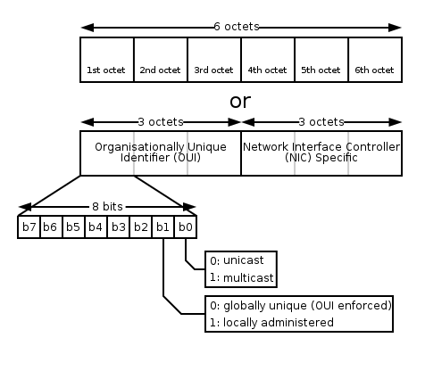

### 关于MAC 地址（Media Access Control Address）

---
作者：俞元

时间：2018-01-19  

---                                                  

1. MAC地址共48位（6个字节），以十六进制表示。前24位由IEEE决定如何分配，后24位由实际生产该网络设备的厂商自行指定。

图片来源  wikipedia链接：https://en.wikipedia.org/wiki/MAC_address

---

## 区分方法

#### 通过B1位区分一些修改过的MAC地址

这个6个字节中的最高有效字节中的最低有效位（b0）用来标识 unicast,和mulcast，即单播 和多播  而**次最低有效位（b1）则用来标识 universally administered address 和  locally administered address**  其中：universally administered address 是指烧录在固件中由厂商指定的地址，也也即大家通常所理解的MAC地址，  而 locally administered address 则是指由网络管理员为了加强自己对网络管理而指定的地址，由定义可知， locally administered address的U/L位要设置成1.所以 要表示 locally administered address的话，那 MAC 地址的第一个字节应该是 0x02, 因此不能够把MAC地址改成其它已经被厂商占用的 universally administered address了。

但是通常情况下，很多人都不会遵守上面的约定。因为 MAC地址通常只能在局域网里发挥作用，因为在网络上传输，MAC地址是会被不断的替换掉的。所以即使你用了 已经被厂商占用的 universally administered address也不用担心会产生冲突。  说到着就更清楚了吧。说到底， **locally administered address 和 universally administered address的区别在于是直接由生产的时候确定的还是由你自己修改过的。**

原文链接：http://blog.sina.com.cn/s/blog_9950926401019kzx.html

#### 通过前3个字节查询对应注册厂商

IEEE注册厂商查询，通过匹配MAC的前3个字节查找对应厂商，如无对应则可认为是一些低级的伪MAC地址。但这个注册厂商列表是公开的，一般的模拟MAC地址时，前3个字节从列表中取即可，而且这样伪造的MAC地址也不存在上面通过B2位判断的问题。

IEEE官网查询地址（可以下载oui.csv）：https://regauth.standards.ieee.org/standards-ra-web/pub/view.html#registries

在线oui对应列表：http://standards-oui.ieee.org/oui/oui.txt

#### 通过流量判断
CSNA网络分析论坛有一种说法是 通过流量判断：伪造的IP或MAC地址，一般都只有单向流量，而且你可以看到其接收或发送的数据包都非常的少。

原文链接：http://www.csna.cn/archiver/tid-2040.html

#### 通过MAC地址前3字节+后3字节

这种整体判断MAC真伪方式暂时还没找到。

----

##### 其他相关链接

- 知乎问题《iOS 8 设备随机 MAC 地址躲避 Wi-Fi 热点的记录追踪，技术上是怎么实现，有何影响？》https://www.zhihu.com/question/24094236
