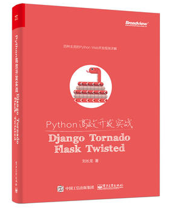
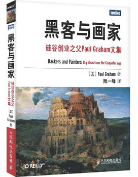
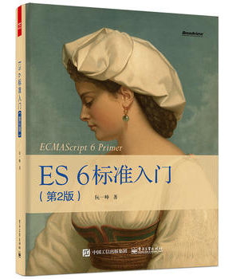
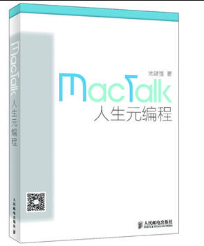
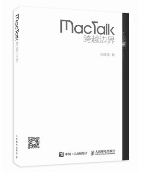

---

## 你赢的书单

- Python web高效开发实战

    - 推荐理由：比较全，而且适合入门。但在一本书中介绍完Python基础，html、css、js，http网络，数据库，web框架，实例项目。没有那么完美，每一个方面需要自己再深入学习。

    - 书籍目录快速浏览参考豆瓣链接： https://book.douban.com/subject/26902158/

    

- 黑客与画家

    - 推荐理由： 故事 还是 思维？

    - 豆瓣链接：https://book.douban.com/subject/6021440/

    

- ES6标准入门
    
    - 推荐理由： 想推荐一本js的书，支持阮一峰。其实关于js还有两本经典书籍。（JavaScript高级程序设计，JavaScript权威指南）

    - 豆瓣链接： https://book.douban.com/subject/26708954/

    

- mactalk 人生元编程

    - 推荐理由：技术人随笔

    - 豆瓣链接： https://book.douban.com/subject/25826578/

    

- mactalk 跨越边界

   - 推荐理由： 技术人随笔

   - 豆瓣链接： https://book.douban.com/subject/26663519/

   

---

## 我赢的书单

- 悟空传（典藏纪念版）

- 理由：我不服。

.png)