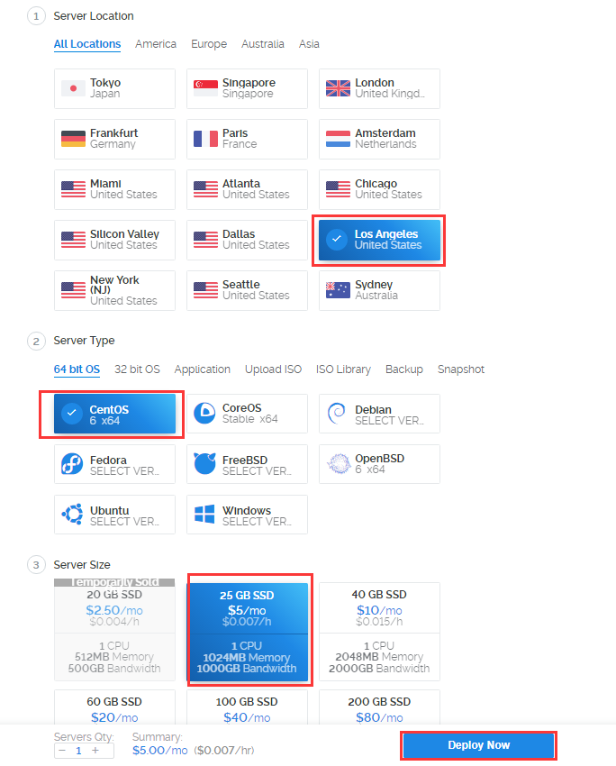
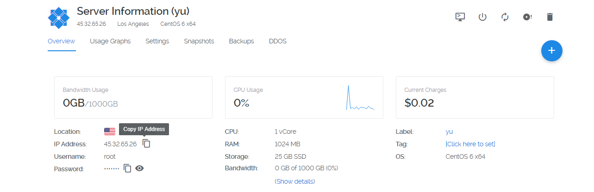
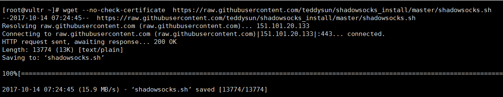
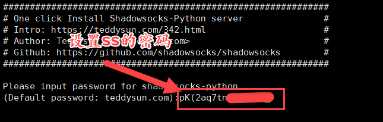
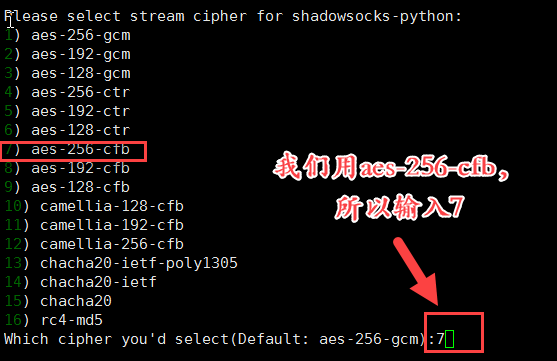
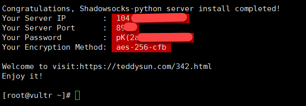
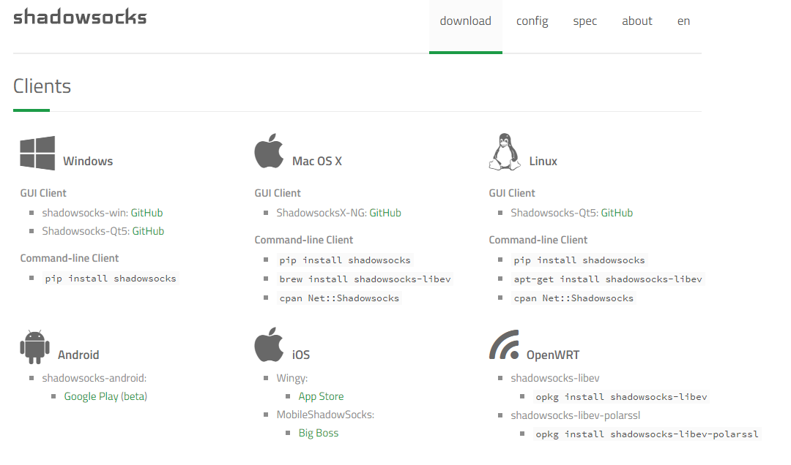
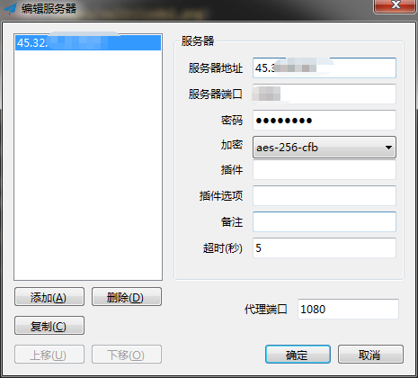

---

# 在vultr上搭建代理服务器

## Server

1. 在vultr上创建账户，并购买一台服务器，5美元每月即可。可以使用alipay支付，最低充值10美元。（https://www.vultr.com/）


2. 使用ssh客户端登录服务器，例如Xshell或者直接命令行  ssh ip@username 。复制你的服务器的ip和密码登录。


3. 执行以下代码下载shadowsocks服务端安装脚本。

```shell
wget --no-check-certificate  https://raw.githubusercontent.com/teddysun/shadowsocks_install/master/shadowsocks.sh

```


4. 修改脚本权限

``` shell
chmod +x shadowsocks.sh
```

5. 运行安装脚本

``` shell
./shadowsocks.sh 2>&1 | tee shadowsocks.log
```

设置密码，并选择加密算法：





最后等待安装，成功后显示：



至此，服务端安装完毕!

---

## Clients

不同平台有对应的客户端：https://shadowsocks.org/en/download/clients.html



- windows 客户端：

    - 链接：[shadowsocks-windows-client-4.0.6.zip](images/vultr/Shadowsocks-4.0.6.zip)

    - 

- android 客户端：

    - 可通过Google play下载。但一般没有翻过去也没法下载，在网上搜索的apk安装后试验，速度比较慢。

- ios 客户端：

    - 可以讲app store 账号的国家设置为美国，搜索wingy下载。（国内appstore已下架）

- mac 客户端：

    - 链接： https://github.com/shadowsocks/ShadowsocksX-NG/releases